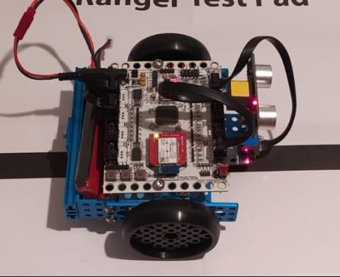
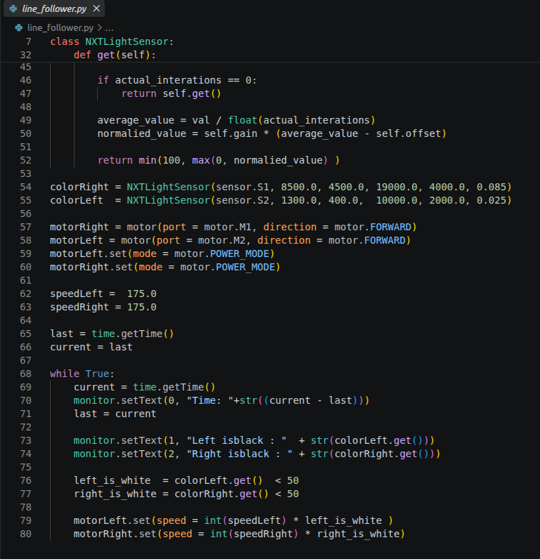

# README

Native MicroPython support for the ORB robot platform - embedding MicroPython Interpreter into ORB firmware and exposing full motor/sensor control through custom C-MicroPython modules, while fully preserving the existing C++ programming workflow.

Ever wondered how to use the MicroPython C API and structure MicroPython modules? Check out [ORB-Python](ORB-Python/src) (built on MicroPython embed port, testable on windows).
<table align="center">
  <tr>
    <td align="center"><strong>ORB Robot</strong></td>
    <td align="center"><strong>MicroPython Example Code</strong></td>
  </tr>
  <tr>
    <td align="center"></td>
    <td align="center"></td>
  </tr>
</table>

# Project Overview
- **Extend ORB Project** STM32-Based robot board project extended with new features (see details below).
- **Full integration of MicroPython into the ORB firmware** wrote native C bindings via the MicroPython C API, exposing all ORB firmware features (motor and sensor control, etc.) to Python through wrapper classes.
- **Windows debug environment for ORB-MicroPython** enabling development, testing, and debugging of ORB-MicroPython from Windows Environment.  
- **Flashing and MicroPython upload tool** making it easy to deploy Python programs to the ORB from a PC.  
- **ORB-Monitor allows MicroPython program uploads** extended ORB-Monitor to allowing users to upload, start, and stop MicroPython programs from GUI-Application.  
- **Maintained full C++ support** ORB-Firmware still allows C++ program development and uploading, so both Python and C++ workflows are supported on the same firmware.  
- **ORB-MicroPython API documentation** what's there to say about it.
- **Miscellaneous tasks** benchmarked MicroPython vs. C++ code, created MicroPython example programs, documented requirements, implementation, ..., and some more smaller tasks.


This is a simple documentation to set up the project and provide a concise explanation of what this project is about. The in-depth documentation is only available in German and can be found [here](Dokumentation).
  
# Project Goal

The goal of this project is to integrate a MicroPython interpreter into the firmware of the Open Robotic Board (ORB).
The ORB is a hardware platform that enables the modular construction of a robot. The ORB-Firmware provides functions, such as motor control, for robot programming. 
These Low-level firmware functions are exposed to MicroPython through wrapper classes, allowing developers to interact with the hardware using a high-level interface.
The aim is to make it possible to develop MicroPython programs for the ORB, with a connection to the ORB-Monitor program.
The ORB-Monitor program is a development tool that allows text output, as well as the uploading, starting, and stopping of programs.
The existing functionalities of the ORB, such as the development of C++ programs, should remain functionally the same.
> [!NOTE]  
> The ORB uses the STM32F405 microcontroller, and schematics for the board are open to the public. All information about the board, additional software, supported sensors, and the original firmware can be found at: [https://github.com/ThBreuer/OpenRoboticBoard](https://github.com/ThBreuer/OpenRoboticBoard).  
This project is based on the design and work of Thomas Breuer regarding the ORB-Projects.

The following steps will guide you through the project setup. If you only want to develop and run Python projects on your ORB, skip to [User Environment](#user-environment).

# Project Setup
- [Setup Code::Blocks Windows Debug Environment](#setup-codeblocks-windows-debug-environment)
- [Building with Code::Blocks](#building-with-codeblocks)
- [Setup EMbitz Firmware Development Environment](#setup-embitz-firmware-development-environment)
- [Flash the Firmware](#flash-the-firmware)
- [Develop a Python Program](#develop-a-python-program)
- [Develop a C++ Program](#develop-a-c-program)

### Setup Code::Blocks Windows Debug Environment

1. (Install Git and) Clone the project:
    ```bash
    git clone https://github.com/NiHoffmann/ORB-MicroPython-EmbedPort
    ```

2. Download and install [Python 3](https://www.python.org/downloads/).  
   Make sure to add Python 3 to your environment variables, so the python3 command is accessible.  
   To check if correctly installed, execute:
    ```bash
    python3 --version
    ```

3. Install the GCC compiler, make, and rm (utils).  
   I suggest using [Msys2](https://www.msys2.org/) for this installation.
   It will come prepackaged with all the needed utilities for this project.  
   Make sure to add the Msys2 bin folder to your PATH.  
   To check if correctly installed, execute:
    ```bash
    gcc --version
    ```

> [!NOTE]  
> If you already have Cygwin installed, it might interfere with the Msys2 installation process. If you encounter any problems, try to remove Cygwin from your Windows PATH variable. You may add it back after the installation is complete.

4. Initialize the MicroPython submodule:
    ```bash
    git submodule init
    git submodule update
    ```

5. Build the mpy-cross compiler:
    ```bash
    cd <ORB-PATH>/micropython/mpy-cross
    make
    ```
   or install it via pip:  
    ```bash
    pip install mpy-cross
    ```
   Make sure to add mpy-cross to your PATH.  
   To check if correctly installed, execute:
    ```bash
    mpy-cross --version
    ```

6. Open the Code::Blocks project.  
   1. Select the GNU GCC compiler and make sure you have the `-Og` compiler flag set.
      (This will suppress potentially application-breaking aggressive optimization.)  
   2. Select the "Rebuild" target. This will build the project and rebuild the MicroPython embedded port.

7. Add `<ORB-PATH>/ORB-Python/tools` to your Windows PATH variable.

### Building with Code::Blocks
There are two build targets for this project: Build & Rebuild.  
Both targets, when built, compile the file `program.py` located in `<ORB-PATH>/ORB-Python/Program`.  
This file will be executed by the MicroPython interpreter; you can write your Python code for testing here.

The differences are as follows:  
- **Build**: Only compiles the Code::Blocks project part. This can be used if there were no QStrings changed (e.g., adding or changing names for functions, modules, or constants). Use this build target to save on compile time.
- **Rebuild**: Also regenerates the MicroPython embedded library, registering changes made to the MicroPython interpreter.

> [!Important] 
> Just running the project will not recompile the `program.py` file. It is suggested to always use the "Build and Run" function.

### Setup EMbitz Firmware Development Environment
Building the firmware is currently only supported in a Windows environment.

1. Follow the steps described in [Setup Code::Blocks Windows Debug Environment](#setup-codeblocks-windows-debug-environment) for a basic project setup.
2. Install [EMbitz](https://www.embitz.org/).
3. Execute the `_setEnv.bat` inside the ORB-Firmware folder.
   > This will set the environment needed for working with the EMB-SysLib.
4. Go to `<ORB-PATH>/ORB-Firmware/project` and start the EMbitz project.
5. In the build options of this project, make sure "GNU Arm Embedded Toolchain" is selected as the compiler.
   > Commonly known as "gcc-arm-none-eabi"; this should come prepackaged with the EMbitz IDE.
6. Select the "Build All" target and rebuild the whole project.

### Flash the Firmware
Build the firmware using the EMbitz project. Alternatively, you can download it from the [releases](./../releases). The release will also include tools to flash the firmware. You may ignore the steps after this and follow the instructions described in the release README.

You may flash the firmware with a tool of your choice.
There is a copy of the DfuSe tool at `ORB/ORB-Firmware/Tools/DfuSe/Bin`.
Additionally, `dfu-util` is available at `ORB/ORB-Python/tools`. Alternatively, you can use the `orb-util` for this. If you want to use `orb-util`, make sure to change the DFU device driver to WinUSB. An easy-to-use tool for this is "Zadig," also available in the tools folder. Put your ORB into DFU-Mode and Execute: 
```bash 
orb-util --flash <HW-Version>
```
To flash your Firmware.
> [!NOTE]  
> To put the ORB in DFU mode, plug a jumper pin into the pins labeled BOOT0 (the outer 2 pins of the 3 present).

### Develop a Python Program
There are two ways to compile and run a Python program.

1. #### Development Environment  
   If you followed the steps to set up the ORB project, you are ready to go. The `orb-util` tool will be available as a command. You can use this to set up and compile MicroPython-Projects.
   Alternatively, you can use the Windows environment for debugging, as described in [Building with Code::Blocks](#building-with-codeblocks).

2. #### User Environment
   1. Download the [project release](./../../releases).
   2. Follow the instructions described in the release README.
  
   This will allow you to develop Python programs without needing to set up the ORB-Project.

### Develop a C++ Program
Go to `ORB/ORB-Application` and execute `_setEnv.bat`. Now you can check out the example projects. Use the different `.bat` files to access documentation, the ORB-Monitor (upload tool), clean the project, or start EMbitz for developing your project. Just like developing a Python program, these are starting points to figure out the workflow.
> [!NOTE]  
> This is not part of my work, but I still feel it's worth mentioning.  
> Although I did some modifications to the ORB-Application (e.g., adding language flags to the linker script and moving the program ROM address to the same location as the Python program).
